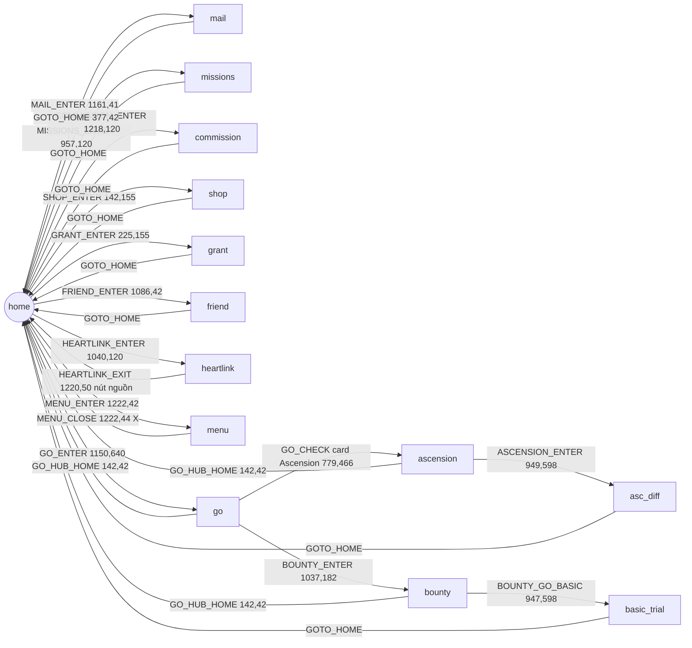

# Game map — Stella Sora EN (khảo sát 2026-07-04, 1280x720)

> Deliverable Phase 2. Nguồn: khảo sát trực tiếp qua ADB trên MuMu, screenshot gốc trong `screenshots/raw/`.
> Page graph đã hiện thực trong `module/ui/pages.py`, asset trong `assets/en/`. Nav test ĐẠT: home⇄missions, home⇄heartlink.

## Page graph

Chưa khảo sát (cần trước Phase 4 tương ứng): **Event** (60,155 — sweep sự kiện), flow **tái phái commission** (chỉ xem được khi có đội về), **Daily Check-in** page (sau nút DAILY_CHECKIN trong menu), các trial khác trong Bounty (Tier-up/Skill/Emblem), Menace Arena / Proving Grounds / Cataclysm Survivor / Boss Blitz trong Go hub.

## Quy tắc điều hướng (RẤT QUAN TRỌNG)

1. **Phím Back Android (keyevent 4) vô dụng** — game nuốt sự kiện. Chỉ điều hướng bằng nút trong game.
2. Trang con chuẩn có chrome đồng nhất: nút Back tròn (55,42) + tiêu đề page + **nút ngôi nhà GOTO_HOME (377,42)**. Check page = template tiêu đề (chữ khác nhau, chrome giống nhau).
3. **Heartlink là ngoại lệ**: UI "điện thoại" fullscreen, không có nhà — thoát bằng nút nguồn (1220,50).
4. Panel Menu là overlay trên home — đóng bằng X (1222,44).
5. Tap vào vùng trống trên home làm nhân vật nói chuyện (bong bóng thoại) — vô hại nhưng đừng dùng làm click "an toàn".
6. **Popup thưởng sau khi claim** đóng được bằng tap vùng trống — đã xác minh tap (640,150) trên missions. Icon top-bar home: túi (1012,41) · bạn bè (1086,42) · thư (1161,41) · hamburger (1222,42) — giữa các icon là dấu chấm phân cách, click vào đó KHÔNG ăn (bug MAIL_ENTER cũ crop lệch tâm).
7. **Go hub + Bounty hub cũng là UI "điện thoại"** (như Heartlink): không có chrome chuẩn, thoát bằng Back (66,42) / Home (142,42) riêng. Nhưng trang con của chúng (Ascension, Basic Trial) LẠI có chrome chuẩn (GOTO_HOME 377,42).
8. **GOTO_HOME threshold 0.80** — tab nền nút nhà đổi sắc nhẹ theo trang (Basic Trial/Ascension chỉ match 0.828; trang không có nút ≤0.454, đo 2026-07-04).
9. **Dialog "Network Error"** (Quit/Retry) hiện ngẫu nhiên khi rớt mạng, che modal toàn màn — template dưới dialog vẫn match (chỉ tối đi nhẹ) nhưng click bị nuốt. Có thể phải Retry vài lần. Đã thêm `NETWORK_RETRY` vào `UI.popup_closers`. ⚠️ Biến thể 2 (2026-07-04 đêm): "Network connection error." với **1 nút Confirm giữa (640,508)** — bấm Confirm bị **đá về màn hình title** ("Select anywhere to start"), phải Login lại. Login đã nhận diện màn title bằng `LOGIN_TAP_START` (threshold 0.7 — nền title xoay art) và tự tap vào.
10. **Game restore activity stack khi app_start** — mở game có thể rơi thẳng vào màn hình đang dở (đã gặp: màn Potential Presets với dialog Rename). Blind-tap của Login vì thế có rủi ro bấm lung tung; dialog chuẩn của game (title cyan + X + Cancel/Confirm) đóng an toàn bằng Cancel/X.

## Từng trang — chi tiết phục vụ task Phase 4

### home
- Check: `HOME_CHECK` = hamburger cyan (1150,0,1280,90).
- Stamina hiển thị góc trên-trái dạng `N/240` (~x130-200, y28-50) — OCR sau này.
- Icon có chấm đỏ động ở góc trên-phải icon → asset ENTER đã crop né vùng chấm đỏ (lấy nửa dưới icon + label).

### mail — task Mail
- Nút: **Claim All (1159,662)**, Delete Read (967,662). Đếm thư góc dưới-trái (N/100).
- Flow: `ui_ensure(page_mail)` → click Claim All → (popup nhận thưởng? — xác nhận khi chạy thật) → về home.

### missions — task DailyReward
- Tab dưới: Tyrant Growth / **Daily Affairs** / Weekly Affairs / Level Rewards.
- **Claim All (1121,592)**; thanh điểm hoạt động 30/60/90/120/150 với nút Claim (1144,64) khi đủ mốc.
- Ví dụ mission daily thật: Invite 1 Trekker in Heartlink, Complete 1 battle in Basic Trial, Participate in Ascension 1 time, Upgrade any Disc level once.

### commission — task Dispatch
- 4 tab trái: Community Service / Mystic Quest / Stellaroid Tracing / Cartridge Recycling.
- List commission phải: tier I/II/III theo loại (Monetary/Experience/Disc Material); đang phái hiện đếm ngược `In Commission: HH:MM:SS` (quan sát 18:46:16 → chu kỳ ~19-20h).
- Limit 4/4 đội. **Claim All (1160,633)** (xám khi chưa có gì nhận).
- Flow tái phái CHƯA khảo sát — làm khi đội về.

### shop — task Shop
- Tab trái: Recommended / Trekker's Picks / Everbright Wishes / Style Gallery / Permit Exchange / Lumina Top-up.
- **Quà daily miễn phí: hộp quà góc dưới-trái (~72,645)** — hiện chữ "Claimed" khi đã nhận (lúc khảo sát đã nhận rồi → cần screenshot trạng thái CHƯA nhận để crop nút claim).
- KHÔNG đụng các nút Go Purchase (tiền thật).

### grant — (tùy chọn, sau)
- "Startup Grant" = battle-pass theo season (26d còn lại), Today's/Weekly Target, Purchase Tier (tiền thật — tránh).
- Nhận milestone tự động hóa được nhưng ưu tiên thấp (không mất gì nếu nhận tay cuối season... vẫn nên nhận daily để chắc).

### friend — task FriendGift
- Tab trái: Profile / **Friend List** / Add Friend. Quà động lực nằm trong Friend List — cần khảo sát sâu tab này (nút nhận & gửi hàng loạt).

### heartlink — task Invite + HeartlinkGift
- UI điện thoại: tab đáy **Chat (148,653) / Invite (273,653) / Mail-phone (398,653)**.
- Chat: danh sách contact, chấm đỏ = có tương tác chờ; "Select contacts to increase Affinity".
- Invite: 5 lượt mời hẹn/ngày (theo MaaStellaSora dùng custom action lặp) — khảo sát sâu khi làm task.

### go (hub, UI điện thoại) — khảo sát 2026-07-04 tối
- Check: `GO_CHECK` = label "✦ Ascension ✦" trên card lớn (click chính nó để vào Ascension).
- Card: **Ascension** (779,350) · **Bounty Trial** (1037,250, badge 40⚡ là icon minh họa) · Menace Arena (975,440) · Proving Grounds (1097,440) · Cataclysm Survivor (975,560) · Boss Blitz (1097,560) · Records (720,585) · Preset (835,585).
- Thoát: Back (66,42) hoặc Home (142,42) = `GO_HUB_HOME`.

### bounty (hub, UI điện thoại) — task Stamina
- Check: `BOUNTY_CHECK` = list item "Basic Trial/Basic Material" (được chọn mặc định).
- 4 trial: **Basic** (EXP/Dorra) / Tier-up / Skill / Emblem. Thanh Vigor hiện ở đầu trang.
- `BOUNTY_GO_BASIC` = nút Go (947,598) vào Basic Trial.

### basic_trial (chrome chuẩn) — task Stamina ✅
- Check: `BASIC_TRIAL_CHECK` = title. Difficulty 1–6 list trái (game NHỚ lựa chọn lần trước).
- **Quick Battle (899,652)** sáng khi difficulty đã clear → dialog chọn số battle (slider, `QB_MAX` = ">>" 905,331) → **Start Battle** (780,508, badge ⚡20/battle ở Difficulty 6) → popup "Battle Complete" → Confirm (640,585). Sweep tức thì, KHÔNG combat. Xác minh 2026-07-04: 48→10 Vigor cho 2 lần sweep.
- Nút "Change" (1101,442) đổi loại thưởng (Note/...) — chưa khảo sát.

### ascension = trang chọn stage Monolith (UI điện thoại) — khảo sát lại 2026-07-04 đêm
- Check: `ASCENSION_CHECK` = badge "Weekly Limit" (397,652). 4 stage: Currents and Shadows / Dust and Flames / Storm and Thunder / Misstep On One (mỗi stage lợi thế 2 nguyên tố, game NHỚ stage chọn lần trước). Weekly Limit N/3000 = điểm nghiên cứu tuần.
- Thoát: Back (66,42) / Home (142,42) = `GO_HUB_HOME` (UI điện thoại như Go hub).
- **Enter Monolith (949,598)** = `ASCENSION_ENTER` → trang difficulty `asc_diff`.

### asc_diff = trang chọn difficulty (chrome chuẩn, title "Ascension") — task Ascension ✅
- Check: `ASCENSION_TITLE` (196,43). Difficulty 2–8 list trái (game NHỚ lựa chọn). Vé Monolith góc trên-phải (273 lúc khảo sát).
- **Quick Battle (887,652)**: tốn 1 vé (KHÔNG tốn Vigor), chỉ sáng khi difficulty đã clear. KHÔNG phải sweep im lặng — vào run Monolith battle-tự-động nhưng roguelike vẫn tương tác:
  1. **Squad** (title "Squad", `SQUAD_NEXT` 1162,665): game nhớ squad; **Potential Preset tự áp theo squad trùng thành viên** (chip "❗Preset set." 1170,97 = `SQUAD_PRESET_SET`; vào nút "Potential Presets" thấy preset khớp có badge "Currently applied.", preset lệch member báo "Trekkers do not match").
  2. **Disc Combo** (title, `DISC_START_BATTLE` 1161,664): giữ setup lần trước.
  3. **Vòng roguelike** (task `tasks/ascension.py::_run_loop`): thẻ trong preset có ribbon đỏ **"Recommended"/"Rcmd: Lv. N" + 👍** (`ASCENSION_RECOMMEND` = icon 👍 tròn, khớp cả 2 biến thể; có thể 2-3 thẻ cùng lúc). Nhiều 👍 → đọc thanh level dưới tên thẻ (`card_lv`, khảo sát 2026-07-05): **"Lv. N"** = thẻ mới nhận thẳng cấp N (gain N, có thể N=3); **"Lv. A ▶ B"** = nâng A→B (gain B−A, có bước nhảy 2 cấp, cả định dạng "Lv. 1+2 ▶ 3+2"); **không có thanh = Super Rare** (không hệ level, thẻ core build → ưu tiên tuyệt đối). Chọn thẻ 👍 gain lớn nhất, hoà → trái nhất; không 👍 → **refresh bộ thẻ 1 lần** (nút ↻ góc phải-dưới 1220,633 `CARD_REFRESH`, 40 coin; CHỈ có ở màn nhận thẻ mới — màn chọn thẻ của Enhance không có nút) rồi đánh giá lại, vẫn không 👍 → giữ thẻ game focus sẵn. Chữ cấp hiện tại màu navy (128,92,72 BGR), cấp sau nâng màu xanh lá (33,155,110); đọc số bằng template `assets/en/ascension/digits/d*.png` (glyph lạ tự dump vào `log/lv_glyphs/`). Tap thẻ để focus (tap y=270 vùng art — ripple tap che thanh Lv nếu tap thấp hơn) → nút Select nhảy theo (y=606, threshold 0.75 vì nút có animation). Chữ "Lv." có 3 kiểu render theo anti-alias (dính w20 / tách "Lv"+"." / mảnh "L","v",".") — parser bắt cả 3; guard: tap focus ≥3 lần không Select được (thanh Lv đọc chập chờn làm quyết định lật) → chọn luôn thẻ đang focus. Toggle **Brief** (1072,44). Event NPC → bấm option chat DƯỚI CÙNG. Hội thoại NPC = icon 📍 teal (1020,651) `DIALOG_PIN` → tap (740,585). Continue (640,653).
  4. **Phòng Shop** (Trade Domain tầng 1-6/2-9/3-8 + phòng cuối tầng 20): options "Purchase at the shop" (`SHOP_PURCHASE`) / "**Enhance (Free 🪙)**" lần đầu MỖI phòng miễn phí rồi +60/lần: Free→60→120→180→... (`SHOP_ENHANCE`) / "Nah, let's go up right away" (giữa run) hoặc nút đỏ **Leave Monolith** (phòng cuối, "big sale"). **Chiến lược v3** (`_do_shop_room`, 2026-07-05): đọc **số dư Starcoin** từ pill góc phải-trên (`read_coins`, OCR template `assets/en/ascension/coin_digits/`, sinh bởi `dev_tools/build_coin_digits.py`) + đọc **giá từng slot** (chữ navy; slot Sold Out tag tối, mất chữ navy → None) + **tag SALE!** đỏ (`SHOP_SALE`). Mua theo thứ tự SALE trước → giá rẻ trước; kệ trên 4× **Potential Drink** (+1 thẻ/level, chọn 1-trong-3) mua tự do; kệ dưới 4× **Melody x5** CHỈ mua khi "cần thiết": dialog mua hiện panel **"Relevant Harmony Skills"** góc trên-trái (`SHOP_RELEVANT`) = note được Harmony Skill của disc dùng (không panel → đóng dialog bỏ qua, dump `log/shop_skip/`; cùng thông tin với viền xanh icon note ở Monolith Bag▸Disc Skills nhưng đọc ngay trong dialog, không phải điều hướng). Khi mua luôn **chừa 360 coin** (= 60+120+180) để Enhance đạt tối thiểu mốc 180; giá kệ có thể đọc sai lẻ tẻ nên khi mở dialog sẽ **đọc lại giá từ hàng Price của dialog** (`dialog_price`, nguồn chuẩn) rồi mới chốt mua; sau mỗi giao dịch đối chiếu số dư đọc được với số học, lệch (ngoài −40 refresh thẻ) → WARNING + dump `log/asc_audit/`. **Enhance**: giá đọc trực tiếp từ dòng option (`enhance_cost`: template `ENHANCE_FREE` bắt chữ "(Free", không thì OCR số — ⚠️ 2 run thật 2026-07-05: **chỉ phòng shop ĐẦU RUN có bậc Free**, các phòng sau vào thẳng 60; mù giá → fallback = giá bậc trước +60); giữa run dừng sau bậc 180 (giữ coin cho shop sau), phòng cuối bấm tới khi số dư < giá; mỗi bậc mở màn chọn 1-trong-3 thẻ (xử lý như bước 3); guard: số dư không đổi 2 nhịp → dừng. ⚠️ **Pill coin/giá enhance có animation đếm** → OCR trả None thoáng qua (thấy run 03:43) → `read_coins`/`enhance_cost` được **retry ~2-3 nhịp** (`_read_coins_stable`) trước khi bỏ cuộc, tránh dừng enhance sớm oan. **Phòng cuối vét sạch**: mua (chừa 360) → refresh kệ (1220,633; 100 coin, ≤2 lượt, chỉ khi dư ≥100+45) → Enhance hết → quay lại shop mua vét (bỏ lọc cần-thiết) vì Starcoin mất trắng khi rời Monolith → Leave Monolith → dialog "Leave anyway?" Confirm (780,508). Dialog Purchase (`SHOP_DIALOG`, mua 640,520, X 935,191) còn treo sau khi bấm mua = thiếu coin → đóng; popup "Musical Notes Acquired!" tap (640,690) — ⚠️ đừng tap (66,37) = mở Monolith Bag.
  5. **Kết thúc**: ASCENDED! (stage + difficulty, Max Floor, Total Potentials; "Select anywhere to continue") → có thể chèn Affinity Level Up/thưởng → **màn Record** ("Unnamed Record"): `SAVE_RECORD` (1137,656) → dialog "Record Saved" Confirm giữa (640,508) → về lại **asc_diff**. ⚠️ Trên màn Record tap giữa màn sẽ mở popup chi tiết thẻ ("Select to close") — tap lần nữa đóng, task tự thoát được.
- Dialog Confirm trong run bắt bằng `ASC_DIALOG_CONFIRM` (common/DIALOG_CONFIRM, area rộng bắt cả Confirm giữa 640,508 lẫn phải 780,508).
- Run Quick Battle + Brief thực đo **~4 phút** không shop, **~8-12 phút** kèm mua sắm 3-4 phòng shop; timeout task 40 phút. Driver khảo sát: `dev_tools/monolith_driver.py` (v2, 👍 trái nhất), `dev_tools/shop_survey.py` (v3, dừng ở shop/enhance), validate parser: `dev_tools/validate_lv_parser.py` + `dev_tools/validate_shop_parser.py` (OCR coin/giá/SALE/Sold Out/panel cần-thiết), smoke: `dev_tools/smoke_ascension_v2.py`, build template số: `dev_tools/build_coin_digits.py`.
- Daily mission "Participate in Ascension 1 time" — task chạy 1 run/ngày, `server_reset`.

### menu (overlay)
- Achievement / Material Crafting / Trekker Encyclopedia / Settings / **Daily Check-in (884,417)** / Change Appearance / News / Support / Redeem Code.
- Task Login nên ghé đây bấm Daily Check-in (điểm danh) → khảo sát trang check-in khi chạy thật.

## Danh sách task daily v1 → trang tương ứng

| Task | Trang | Hành động chính | Sẵn sàng code? |
|---|---|---|---|
| Login | (cold start) → home | vượt popup, check-in qua menu | ✅ (check-in bổ sung sau) |
| Mail | mail | Claim All | ✅ đã code + test 2026-07-04 |
| DailyReward | missions | Claim All + claim mốc điểm | ✅ đã code + test 2026-07-04 (cả nhánh Claim All xám) |
| Dispatch | commission | Claim All + tái phái 4 đội | 🟡 claim-only đã code + test nhánh xám 2026-07-04; tái phái chờ đội về |
| Shop | shop | nhận quà free góc dưới-trái | ✅ đã code (detect "Claimed"; nhánh chưa-nhận chờ xác minh sau reset) |
| Stamina | go → bounty → basic_trial | Quick Battle sweep max Vigor | ✅ đã code + test sweep thật 2026-07-04 |
| Cleanup | → home | về home, (config) đóng game | ✅ đã code + test 2026-07-04 |
| FriendGift | friend > Friend List | nhận & gửi động lực | ⏳ khảo sát sâu tab |
| Ascension | go → ascension → asc_diff | Quick Battle run Monolith (1 vé, ~8-12 phút): chọn thẻ 👍 theo mức tăng level (không 👍 → refresh 40 coin 1 lần), shop v3 (SALE trước, Melody chỉ mua khi cần thiết, chừa 360 coin enhance mốc 180, phòng cuối vét sạch), Save Record | ✅ v2 run thật 2026-07-05; 🟡 v3 chiến lược shop chờ test run thật |

## Việc còn nợ Phase 2

- [ ] Xác minh giờ reset daily EN (config đang mặc định 11:00 UTC) — xem trong Missions/Check-in lúc gần reset.
- [x] Khảo sát Go hub (2026-07-04: go/bounty/basic_trial/ascension — xong). Còn **Event** (60,155) chưa khảo sát.
- [ ] Khảo sát flow tái phái commission khi đội về (đội hiện tại về ~12:49 trưa 2026-07-05 giờ máy; Dispatch tự check mỗi 4h sẽ Claim All, sau đó slot trống → vào khảo sát màn phái đội: 3 slot Trekker "+", Requirement/Bonus, nút dispatch).
- [ ] Xác minh nhánh Shop chưa-nhận sau reset (task tự chạy; nếu fail xem `log/error/`).
- [ ] Catalog popup login (chạy `python sst.py Login` sau khi tắt game — popup event/check-in sẽ hiện, crop closer vào `UI.popup_closers`). Lần chạy 2026-07-04 tối không có popup nào.
