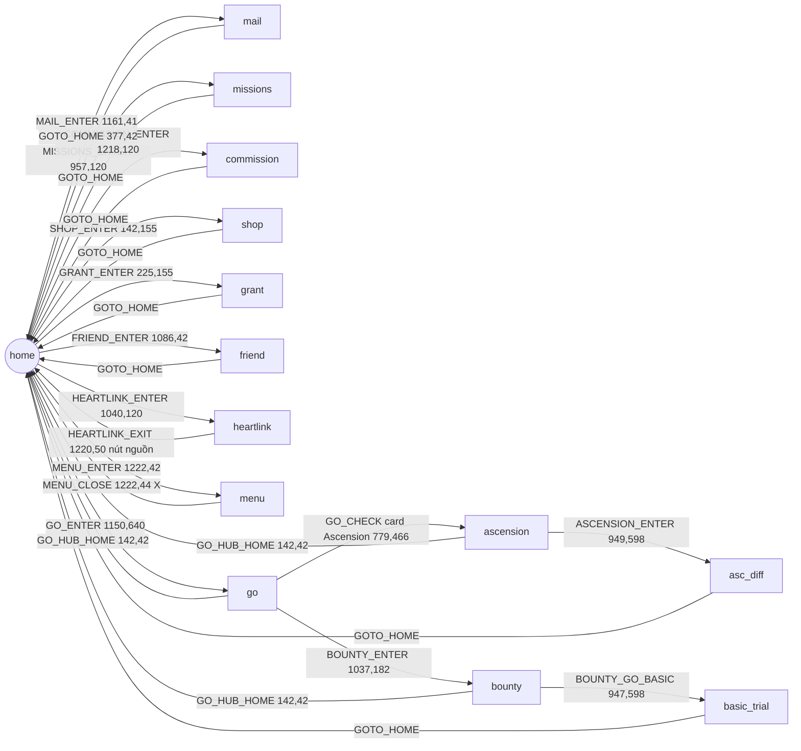

# Game map — Stella Sora EN (khảo sát 2026-07-04, 1280x720)

> Deliverable Phase 2. Nguồn: khảo sát trực tiếp qua ADB trên MuMu, screenshot gốc trong `screenshots/raw/`.
> Page graph đã hiện thực trong `module/ui/pages.py`, asset trong `assets/en/`. Nav test ĐẠT: home⇄missions, home⇄heartlink.

## Page graph

Đã khảo sát thêm 2026-07-05: **Event** → task EventDaily (home banner → Battle Stage → Quick Battle; xem mục ### event). Chưa khảo sát: **Daily Check-in** page (sau nút DAILY_CHECKIN trong menu), các trial khác trong Bounty (Tier-up/Skill/Emblem), Menace Arena / Proving Grounds / Cataclysm Survivor / Boss Blitz trong Go hub, Event Shop / Event Missions / Story trong event interior.

## Quy tắc điều hướng (RẤT QUAN TRỌNG)

1. **Phím Back Android (keyevent 4) vô dụng** — game nuốt sự kiện. Chỉ điều hướng bằng nút trong game.
2. Trang con chuẩn có chrome đồng nhất: nút Back tròn (55,42) + tiêu đề page + **nút ngôi nhà GOTO_HOME (377,42)**. Check page = template tiêu đề (chữ khác nhau, chrome giống nhau).
3. **Heartlink là ngoại lệ**: UI "điện thoại" fullscreen, không có nhà — thoát bằng nút nguồn (1220,50).
4. Panel Menu là overlay trên home — đóng bằng X (1222,44).
5. Tap vào vùng trống trên home làm nhân vật nói chuyện (bong bóng thoại) — vô hại nhưng đừng dùng làm click "an toàn".
6. **Popup thưởng sau khi claim** đóng được bằng tap vùng trống — đã xác minh tap (640,150) trên missions. Icon top-bar home: túi (1012,41) · bạn bè (1086,42) · thư (1161,41) · hamburger (1222,42) — giữa các icon là dấu chấm phân cách, click vào đó KHÔNG ăn (bug MAIL_ENTER cũ crop lệch tâm). ⚠️ **KHÔNG áp dụng cho modal có nút** (Commission Complete!, dialog Confirm...) — tap vùng trống không đóng, phải bấm nút (bug Dispatch 2026-07-05: tap mù 10 lần → GameTooManyClick).
6b. **Nền home đổi art theo nhân vật nổi bật** (rotate theo thời gian/event) → template icon nav **dính nền sẽ vỡ match** khi nhân vật đổi (2026-07-05: `SHOP_ENTER` tụt 0.796, `MISSIONS_ENTER` 0.606, task Shop timeout). Quy tắc: crop icon home **TIGHT chỉ phần glyph opaque** (không lấy nền), threshold ~0.80. Cách sửa: align asset cũ vào home mới → pixel khớp = icon, lệch = nền → lấy bbox vùng icon thuần (validate bằng match vs asset nền cũ >0.85). Icon góc/ổn định (HOME_CHECK, COMMISSION_ENTER, GRANT_ENTER) không bị.
7. **Go hub + Bounty hub cũng là UI "điện thoại"** (như Heartlink): không có chrome chuẩn, thoát bằng Back (66,42) / Home (142,42) riêng. Nhưng trang con của chúng (Ascension, Basic Trial) LẠI có chrome chuẩn (GOTO_HOME 377,42).
8. **GOTO_HOME threshold 0.80** — tab nền nút nhà đổi sắc nhẹ theo trang (Basic Trial/Ascension chỉ match 0.828; trang không có nút ≤0.454, đo 2026-07-04).
9. **Dialog "Network Error"** (Quit/Retry) hiện ngẫu nhiên khi rớt mạng, che modal toàn màn — template dưới dialog vẫn match (chỉ tối đi nhẹ) nhưng click bị nuốt. Có thể phải Retry vài lần. Đã thêm `NETWORK_RETRY` vào `UI.popup_closers`. ⚠️ Biến thể 2 (2026-07-04 đêm): "Network connection error." với **1 nút Confirm giữa (640,508)** — bấm Confirm bị **đá về màn hình title** ("Select anywhere to start"), phải Login lại. Login đã nhận diện màn title bằng `LOGIN_TAP_START` (threshold 0.7 — nền title xoay art) và tự tap vào.
10. **Game restore activity stack khi app_start** — mở game có thể rơi thẳng vào màn hình đang dở (đã gặp: màn Potential Presets với dialog Rename). Blind-tap của Login vì thế có rủi ro bấm lung tung; dialog chuẩn của game (title cyan + X + Cancel/Confirm) đóng an toàn bằng Cancel/X.

## Từng trang — chi tiết phục vụ task Phase 4

### home
- Check: `HOME_CHECK` = hamburger cyan (1150,0,1280,90).
- Stamina hiển thị góc trên-trái dạng `N/240` (~x130-200, y28-50) — OCR sau này.
- Icon có chấm đỏ động ở góc trên-phải icon → asset ENTER đã crop né vùng chấm đỏ (lấy nửa dưới icon + label).

### mail — task Mail
- Nút: **Claim All (1159,662)**, Delete Read (967,662). Đếm thư góc dưới-trái (N/100).
- Flow: `ui_ensure(page_mail)` → click Claim All → (popup nhận thưởng? — xác nhận khi chạy thật) → về home.

### missions — task DailyReward
- Tab dưới: Tyrant Growth / **Daily Affairs** / Weekly Affairs / Level Rewards.
- **Claim All (1121,592)**; thanh điểm hoạt động 30/60/90/120/150 với nút Claim (1144,64) khi đủ mốc.
- Ví dụ mission daily thật: Invite 1 Trekker in Heartlink, Complete 1 battle in Basic Trial, Participate in Ascension 1 time, Upgrade any Disc level once.

### commission — task Dispatch
- 4 tab trái: Community Service / Mystic Quest / Stellaroid Tracing / Cartridge Recycling.
- List commission phải: tier I/II/III theo loại (Monetary/Experience/Disc Material); đang phái hiện đếm ngược `In Commission: HH:MM:SS` (quan sát 18:46:16 → chu kỳ ~19-20h).
- Limit 4/4 đội. **Claim All (1160,633)** (xám khi chưa có gì nhận). Claim → modal "Commission Complete!" (nút **Back** 498,570 đóng / **Dispatch Again** 779,570 / X 1051,112) — MODAL, tap mù không đóng (xem gotcha #6).
- **Flow phái 1 commission** (khảo sát live 2026-07-05): chọn commission ở list trái (x275, y 115/186/258/329/400/471/542/613) → panel phải hiện Requirement (Vanguard/Versatile...) + Bonus + 3 slot "Commission Trekker" + Lv Req → **Quick Select (946,548)** tự điền đội hợp Requirement+Bonus (số Trekker biến thiên 2-3, checkmark xanh khi đủ, reward "Locked"→"Possible") → chọn thời lượng **4h/8h/12h/20h** (radio y491, x 820/937/1043/**1128**; 20h reward gấp ~5x 4h, Quick Select reset về 4h nên chọn 20h SAU) → **Accept Commission (1138,548)** → animation "Commission Start!" (`COMMISSION_START`) → panel chuyển nút **Recall (1138,548)** + bar "In Commission" (= đã phái). Task `_redispatch` lặp điền tới 4/4, đếm cả slot đã phái sẵn để dừng đúng.

### shop — task Shop
- Tab trái: Recommended / Trekker's Picks / Everbright Wishes / Style Gallery / Permit Exchange / Lumina Top-up.
- **Quà daily miễn phí: hộp quà góc dưới-trái (~72,645)** — hiện chữ "Claimed" khi đã nhận (lúc khảo sát đã nhận rồi → cần screenshot trạng thái CHƯA nhận để crop nút claim).
- KHÔNG đụng các nút Go Purchase (tiền thật).

### grant — (tùy chọn, sau)
- "Startup Grant" = battle-pass theo season (26d còn lại), Today's/Weekly Target, Purchase Tier (tiền thật — tránh).
- Nhận milestone tự động hóa được nhưng ưu tiên thấp (không mất gì nếu nhận tay cuối season... vẫn nên nhận daily để chắc).

### friend — task FriendGift
- Tab trái: Profile / **Friend List** / Add Friend. Quà động lực nằm trong Friend List — cần khảo sát sâu tab này (nút nhận & gửi hàng loạt).

### heartlink — task Heartlink (con Invite ✅ + Mail ✅) — khảo sát live 2026-07-08
- UI điện thoại: vào bằng `HEARTLINK_ENTER` (icon 2 bong bóng chat, ~1040,120), thoát bằng nút nguồn
  `HEARTLINK_EXIT` (1220,50). Tab đáy: **Chat (155,653) / Invite (288,653) / Mail (397,653)**. Mở mặc
  định vào **Chat**. `HEARTLINK_CHECK` (tab bar) chỉ match khi Chat được chọn (không match tab Invite).
- **Invite** (`HL_INVITE_TITLE` xác nhận): lưới portrait NV **3 cột** — cột x=(147,272,399), hàng
  y=(232,388,543) (còn hàng dưới, cuộn — chưa làm). Panel phải: header NV (tên/Affinity/Special Memory)
  + nút **Invite (894,647)**. **"Invited Today: N/5"** góc phải-dưới (giới hạn 5 lượt/ngày).
- **Trạng thái NV** (panel render có LAG → poll tới khi rõ): `HL_INVITE_BTN` teal "Invite" = còn hẹn được;
  `HL_INVITED_TODAY` xám "Invited Today" = đã hẹn hôm nay (portrait có **✓ xanh** góc trên).
- **1 lượt hẹn**: Invite (894,647) → **"Select Date Location"** (`HL_SELECT_LOCATION`; 3 ô KHÁC nhau theo
  NV) → tap **ô ĐẦU Select (1131,263)** → animation xe chạy → **màn hẹn hò** (nền địa điểm + text box +
  cụm nút góc phải-trên: clock/replay/play/**Skip ▶| (1189,78)**) → bấm Skip tua nhanh (revealed text +
  "Connecting..." → tự tới cuối) → cuối buổi hiện **"Send Gift (983,519) / Leave (983,592)"**
  (`HL_SEND_GIFT`; "This marks the end of an amazing day").
- **Gift**: Send Gift → lưới quà 5 cột (mỗi item mặt 😄/🙂/😐 = độ thích; **"Gift Limit 1"**) → chọn **ô
  đầu (798,300)** (loved, +affinity preview) → **Send Gift (1097,635)** → reaction → **"Gifts Received!"**
  (đáp lễ, "Select anywhere to continue") → **"<NV> Affinity UP"** → tap về Invite (+1/5). `HL_GIFT_NEVERMIND`
  nhận biết lưới quà; dismiss overlay = tap (640,150).
- **Cap ngày**: ở 5/5, chọn NV chưa hẹn vẫn có nút Invite active nhưng bấm KHÔNG mở Location (chỉ toast) →
  task coi là cap → dừng. Skip ▶| KHÔNG dính dialog "leaving early" (khớp affinity đầy đủ, không phạt).
- **Ưu tiên theo tên** (`invite_targets`): lưới thứ tự CỐ ĐỊNH (NV đã hẹn KHÔNG bị đẩy xuống) → grid-order
  luôn chọn top; favorite ở dưới phải **cuộn tìm portrait** (`assets/en/heartlink/chars/<slug>.png`,
  match cv2 vùng lưới (95,178,460,700); swipe 270:520↔300 cuộn). Roster 18+ NV → chỉ crop favorite.
- **Mail = "Delivery Service"** (gửi quà tăng affinity, **10 quà/ngày GLOBAL** — Fuyuka cũng 10/10): tab
  Mail (397,653) → list NV bên trái (affinity+địa chỉ; NV trên cùng ~275,218) → panel phải "Delivery
  Service" (`HL_MAIL_TITLE`) + lưới quà (ô đầu 694,325) + **Send Gift** (893,646) + "Gifts Sent Today N/10".
  Chọn NV → tap ô quà đầu (loved) → Send Gift → dismiss reaction/"Affinity UP" (tap 640,150) → lặp.
  Cap-detect: thanh Affinity (755-1090, 198-224) đứng yên sau gửi = 10/10. Config: `mail_count`,
  `mail_targets` (name+qty; rỗng=dồn NV trên cùng). ✅ **Send loop VERIFY LIVE 2026-07-08 tới cap
  THẬT** (2 quà sáng + 8 quà trưa = 10/10, Chitose 1350→9050): tại 10/10 game từ chối LẶNG LẼ
  (không overlay/reaction) → Affinity đứng yên → cap-detect bắt đúng, đếm đúng 8 quà. Counter
  "Gifts Sent Today **10/10**" chuyển số ĐỎ (~x1108-1145, y660) = tín hiệu màu để detect cap TRỰC
  TIẾP nếu cần sau này; nút Send Gift vẫn teal khi cap (KHÔNG dùng làm tín hiệu được).
- ⚠️ **Overlay sau date XẾP HÀNG nhiều lớp** (reaction → "Gifts Received!" → "Affinity UP"):
  `_dismiss_to_invite` có thể bắt 1 frame Invite GIỮA các lớp rồi thoát, các lớp còn lại nuốt các cú
  tap tab đáy phone liên tiếp → `_open_tab` retry 4 lần + tap dismiss (640,150) giữa các lần (live
  2026-07-08: 2 tap Mail liền bị nuốt; sau fix, tap thứ 2 sau dismiss vào được).
- Còn nợ: crop portrait list Mail (nhỏ hơn lưới Invite) cho custom
  name; crop portrait từng favorite; dialog "leaving early" (chưa gặp khi Skip).

### go (hub, UI điện thoại) — khảo sát 2026-07-04 tối
- Check: `GO_CHECK` = label "✦ Ascension ✦" trên card lớn (click chính nó để vào Ascension).
- Card: **Ascension** (779,350) · **Bounty Trial** (1037,250, badge 40⚡ là icon minh họa) · Menace Arena (975,440) · Proving Grounds (1097,440) · Cataclysm Survivor (975,560) · Boss Blitz (1097,560) · Records (720,585) · Preset (835,585).
- Thoát: Back (66,42) hoặc Home (142,42) = `GO_HUB_HOME`.

### bounty (hub, UI điện thoại) — task Stamina
- Check: `BOUNTY_CHECK` = list item "Basic Trial/Basic Material" (được chọn mặc định).
- 4 trial: **Basic** (EXP/Dorra) / Tier-up / Skill / Emblem. Thanh Vigor hiện ở đầu trang.
- `BOUNTY_GO_BASIC` = nút Go (947,598) vào Basic Trial.

### basic_trial (chrome chuẩn) — task Stamina ✅
- Check: `BASIC_TRIAL_CHECK` = title. Difficulty 1–6 list trái (game NHỚ lựa chọn lần trước).
- **Quick Battle (899,652)** sáng khi difficulty đã clear → dialog chọn số battle (slider, `QB_MAX` = ">>" 905,331) → **Start Battle** (780,508, badge ⚡20/battle ở Difficulty 6) → popup "Battle Complete" → Confirm (640,585). Sweep tức thì, KHÔNG combat. Xác minh 2026-07-04: 48→10 Vigor cho 2 lần sweep.
- Nút "Change" (1101,442) đổi loại thưởng (Note/...) — chưa khảo sát.

### ascension = trang chọn stage Monolith (UI điện thoại) — khảo sát lại 2026-07-04 đêm
- Check: `ASCENSION_CHECK` = badge "Weekly Limit" (397,652). 4 stage: Currents and Shadows / Dust and Flames / Storm and Thunder / Misstep On One (mỗi stage lợi thế 2 nguyên tố, game NHỚ stage chọn lần trước). Weekly Limit N/3000 = điểm nghiên cứu tuần.
- **Chọn map** (khảo sát live 2026-07-05, config `ascension.map`): 4 card xếp dọc bên trái (nhãn tên map y-center ~123/253/382/528, cách nhau ~130px), preview map đang chọn ở "điện thoại" bên phải. Map đang chọn có **khung góc XANH LÁ** (bắt ở dải trái x6-46, `selected_map_center` = trung điểm 2 cụm khung trên+dưới — phải ghép cặp vì khung cao ~135px gần dính card kề). Chọn = tap nhãn map (`MAP_CURRENTS/DUST/STORM/MISSTEP`, khớp 1.000, thr 0.85) rồi verify khung xanh trùng y card; validate live: chọn STORM→center 401, về CURRENTS→143. Tool chỉ đụng khi `map != ''`; sau đó `ui_ensure(page_asc_diff)` tự bấm Enter Monolith.
- Thoát: Back (66,42) / Home (142,42) = `GO_HUB_HOME` (UI điện thoại như Go hub).
- **Enter Monolith (949,598)** = `ASCENSION_ENTER` → trang difficulty `asc_diff`.

### asc_diff = trang chọn difficulty (chrome chuẩn, title "Ascension") — task Ascension ✅
- Check: `ASCENSION_TITLE` (196,43). Difficulty 2–8 list trái (game NHỚ lựa chọn). Vé Monolith góc trên-phải (273 lúc khảo sát).
- **Quick Battle (887,652)**: tốn 1 vé (KHÔNG tốn Vigor), chỉ sáng khi difficulty đã clear. KHÔNG phải sweep im lặng — vào run Monolith battle-tự-động nhưng roguelike vẫn tương tác:
  1. **Squad** (title "Squad", `SQUAD_NEXT` 1162,665): game nhớ squad; **Potential Preset tự áp theo squad trùng thành viên** (chip "❗Preset set." 1170,97 = `SQUAD_PRESET_SET`; vào nút "Potential Presets" thấy preset khớp có badge "Currently applied.", preset lệch member báo "Trekkers do not match"). **Chọn squad** (khảo sát live 2026-07-05, tài khoản 6 squad): mũi tên ◄ (60,357) = squad −1, ► (1220,357) = squad +1, **CẢ HAI wrap vòng** (squad 1 ◄ squad N). Hàng **dot dưới tiêu đề** cho biết squad hiện tại + tổng số: `read_squad(img)` đọc dot sáng (trắng) trong chuỗi dot cách đều ~8px (band y62-74, x595-690; lọc chuỗi spacing đều để rớt blob rác), validate đúng squad 2/3/5. Config `ascension.squad` (0 = giữ nguyên) → `_goto_squad` đi hướng ngắn nhất (feedback từng bước). **Khi preset CHƯA set**: hiện pill navy "❗Preset not set." (KHÔNG icon kính lúp, khác "Preset set.") = `SQUAD_PRESET_NOT_SET` (1080,78–1265,118, thr 0.85, khớp 0.99+); config `ascension.preset_behavior` warn/skip/abort.
  2. **Disc Combo** (title, `DISC_START_BATTLE` 1161,664): giữ setup lần trước.
  3. **Vòng roguelike** (task `tasks/ascension.py::_run_loop`): thẻ trong preset có ribbon đỏ **"Recommended"/"Rcmd: Lv. N" + 👍** (`ASCENSION_RECOMMEND` = icon 👍 tròn, khớp cả 2 biến thể; có thể 2-3 thẻ cùng lúc). Nhiều 👍 → đọc thanh level dưới tên thẻ (`card_lv`, khảo sát 2026-07-05): **"Lv. N"** = thẻ mới nhận thẳng cấp N (gain N, có thể N=3); **"Lv. A ▶ B"** = nâng A→B (gain B−A, có bước nhảy 2 cấp, cả định dạng "Lv. 1+2 ▶ 3+2"); **không có thanh = Super Rare** (không hệ level, thẻ core build → ưu tiên tuyệt đối). Chọn thẻ 👍 gain lớn nhất, hoà → trái nhất; không 👍 → **refresh bộ thẻ 1 lần** (nút ↻ góc phải-dưới 1220,633 `CARD_REFRESH`, 40 coin; CHỈ có ở màn nhận thẻ mới — màn chọn thẻ của Enhance không có nút) rồi đánh giá lại, vẫn không 👍 → giữ thẻ game focus sẵn. Chữ cấp hiện tại màu navy (128,92,72 BGR), cấp sau nâng màu xanh lá (33,155,110); đọc số bằng template `assets/en/ascension/digits/d*.png` (glyph lạ tự dump vào `log/lv_glyphs/`). Tap thẻ để focus (tap y=270 vùng art — ripple tap che thanh Lv nếu tap thấp hơn) → nút Select nhảy theo (y=606, threshold 0.75 vì nút có animation). Chữ "Lv." có 3 kiểu render theo anti-alias (dính w20 / tách "Lv"+"." / mảnh "L","v",".") — parser bắt cả 3; guard: tap focus ≥3 lần không Select được (thanh Lv đọc chập chờn làm quyết định lật) → chọn luôn thẻ đang focus. Toggle **Brief** (1072,44). Event NPC → bấm option chat DƯỚI CÙNG. Hội thoại NPC = icon 📍 teal (1020,651) `DIALOG_PIN` → tap (740,585). Continue (640,653).
  4. **Phòng Shop** (Trade Domain tầng 1-6/2-9/3-8 + phòng cuối tầng 20): options "Purchase at the shop" (`SHOP_PURCHASE`) / "**Enhance (Free 🪙)**" lần đầu MỖI phòng miễn phí rồi +60/lần: Free→60→120→180→... (`SHOP_ENHANCE`) / "Nah, let's go up right away" (giữa run) hoặc nút đỏ **Leave Monolith** (phòng cuối, "big sale"). **Chiến lược v3** (`_do_shop_room`, 2026-07-05): đọc **số dư Starcoin** từ pill góc phải-trên (`read_coins`, OCR template `assets/en/ascension/coin_digits/`, sinh bởi `dev_tools/build_coin_digits.py`) + đọc **giá từng slot** (chữ navy; slot Sold Out tag tối, mất chữ navy → None) + **tag SALE!** đỏ (`SHOP_SALE`). Mua theo thứ tự SALE trước → giá rẻ trước; kệ trên 4× **Potential Drink** (+1 thẻ/level, chọn 1-trong-3) mua tự do; kệ dưới 4× **Melody x5** CHỈ mua khi "cần thiết": dialog mua hiện panel **"Relevant Harmony Skills"** góc trên-trái (`SHOP_RELEVANT`) = note được Harmony Skill của disc dùng (không panel → đóng dialog bỏ qua, dump `log/shop_skip/`; cùng thông tin với viền xanh icon note ở Monolith Bag▸Disc Skills nhưng đọc ngay trong dialog, không phải điều hướng). Khi mua luôn **chừa 360 coin** (= 60+120+180) để Enhance đạt tối thiểu mốc 180; giá kệ có thể đọc sai lẻ tẻ nên khi mở dialog sẽ **đọc lại giá từ hàng Price của dialog** (`dialog_price`, nguồn chuẩn) rồi mới chốt mua; sau mỗi giao dịch đối chiếu số dư đọc được với số học, lệch (ngoài −40 refresh thẻ) → WARNING + dump `log/asc_audit/`. **Enhance**: giá đọc trực tiếp từ dòng option (`enhance_cost`: template `ENHANCE_FREE` bắt chữ "(Free", không thì OCR số — ⚠️ 2 run thật 2026-07-05: **chỉ phòng shop ĐẦU RUN có bậc Free**, các phòng sau vào thẳng 60; mù giá → fallback = giá bậc trước +60); giữa run dừng sau bậc 180 (giữ coin cho shop sau), phòng cuối bấm tới khi số dư < giá; mỗi bậc mở màn chọn 1-trong-3 thẻ (xử lý như bước 3); guard: số dư không đổi 2 nhịp → dừng. ⚠️ **Pill coin/giá enhance có animation đếm** → OCR trả None thoáng qua (thấy run 03:43) → `read_coins`/`enhance_cost` được **retry ~2-3 nhịp** (`_read_coins_stable`) trước khi bỏ cuộc, tránh dừng enhance sớm oan. **Phòng cuối vét sạch**: mua (chừa 360) → refresh kệ (1220,633; 100 coin, ≤2 lượt, chỉ khi dư ≥100+45) → Enhance hết → quay lại shop mua vét (bỏ lọc cần-thiết) vì Starcoin mất trắng khi rời Monolith → Leave Monolith → dialog "Leave anyway?" Confirm (780,508). Dialog Purchase (`SHOP_DIALOG`, mua 640,520, X 935,191) còn treo sau khi bấm mua = thiếu coin → đóng; popup "Musical Notes Acquired!" tap (640,690) — ⚠️ đừng tap (66,37) = mở Monolith Bag.
  5. **Kết thúc**: ASCENDED! (stage + difficulty, Max Floor, Total Potentials; "Select anywhere to continue") → có thể chèn Affinity Level Up/thưởng → **màn Record** ("Unnamed Record"): `SAVE_RECORD` (1137,656) → dialog "Record Saved" Confirm giữa (640,508) → về lại **asc_diff**. ⚠️ Trên màn Record tap giữa màn sẽ mở popup chi tiết thẻ ("Select to close") — tap lần nữa đóng, task tự thoát được.
- Dialog Confirm trong run bắt bằng `ASC_DIALOG_CONFIRM` (common/DIALOG_CONFIRM, area rộng bắt cả Confirm giữa 640,508 lẫn phải 780,508).
- Run Quick Battle + Brief thực đo **~4 phút** không shop, **~8-12 phút** kèm mua sắm 3-4 phòng shop; timeout task 40 phút. Driver khảo sát: `dev_tools/monolith_driver.py` (v2, 👍 trái nhất), `dev_tools/shop_survey.py` (v3, dừng ở shop/enhance), validate parser: `dev_tools/validate_lv_parser.py` + `dev_tools/validate_shop_parser.py` (OCR coin/giá/SALE/Sold Out/panel cần-thiết), smoke: `dev_tools/smoke_ascension_v2.py`, build template số: `dev_tools/build_coin_digits.py`.
- Daily mission "Participate in Ascension 1 time" — task chạy 1 run/ngày, `server_reset`.

### records = màn Records + Dismantle (rã Record → Journey Ticket Stub) — khảo sát live 2026-07-07
- **Vào**: Home → **Go** (van, ~1195,655) → Ascension hub (UI điện thoại) → nút **Records** (~715,585,
  icon quân cờ, dưới tile Ascension; cạnh nút **Preset** ~835,585). Hub còn: Ascension (tile lớn), Bounty
  Trial, Menace Arena, Proving Grounds, Cataclysm Survivor, Boss Blitz.
- **Màn Records**: lưới card (2 hàng × 4 cột/trang, cuộn dọc). Mỗi card: **badge lục giác góc trên-trái =
  RANK Record** (số ~30-40; §4 rank tối đa 40; màu badge theo tier, một số gold) + tên + **icon khoá góc
  trên-phải** (record khoá KHÔNG rã được) + Trekkers (Main/Support, mỗi cái có số +N) + Main Discs. Góc
  phải-trên: **"N/100"** (số record/sức chứa) · **"Dismantle"** (pill đỏ ~985,42) · "Bonus Overview".
  Dưới-phải: sort **"Last Saved" / "Rating"** + filter (⇒ có thể sort Rating để record rank thấp lên đầu).
- **Chế độ Dismantle** (bấm "Dismantle" ~985,42) → thanh dưới hiện:
  - dropdown **tier** (mặc định "Master and below", ~145,630) → mở ra 4 mức: **Average / Advanced / Expert
    / Master and below** = rã theo **BAND rank**, KHÔNG theo số rank chính xác.
  - **"Select All Filtering"** (~130,682): tự chọn mọi record ≤ tier đã chọn (bỏ record khoá).
  - **"Selected N/20"** (tối đa **20/lượt**) · **"Close"** (~905,670, huỷ, KHÔNG rã) · **"Dismantle"** (đỏ
    ~1140,670, XÁC NHẬN).
  - Record được chọn có **viền đỏ**; preview thưởng **"Can Receive: Journey Ticket Stub ×N"** giữa-dưới
    (test live: "Master and below" chọn **5/20** → **×367 stub**; các record rank 32-33 KHÔNG được chọn ⇒
    nằm trên tier Master ⇒ tier là band rank thật, không phải "chọn tất").
- **⚠️ THIẾT KẾ**: game rã hàng loạt theo **TIER** (Average..Master), KHÔNG có bộ lọc "rank ≤ số N" chính
  xác. ⇒ tool nên cho chọn **tier** thay vì nhập số level, HOẶC OCR badge rank + tap-chọn từng record ≤ N
  (max 20/lượt, bỏ record khoá) — xem đề xuất ở docs/ascension-improvements.md.
- **Chưa khảo sát** (giữ Record thật, KHÔNG bấm confirm): dialog xác nhận sau nút Dismantle cuối; tap-chọn
  thủ công từng record; map chính xác tier↔rank. Ảnh: `screenshots/raw/dissolve_record/01_home..07_after_close`.
  Asset cần crop khi code: `RECORDS_ENTER` (hub), `DISMANTLE_BTN`, dropdown tier, `SELECT_ALL_FILTERING`,
  `DISMANTLE_CONFIRM`.
- **★ Màn Save Record (cuối run) = quyết định LƯU vs HUỶ ngay theo rank** (khảo sát live 2026-07-07, frame
  `data/ascension_capture/20260707_140335/run_01/0366`): màn "Unnamed Record" hiện **badge RANK** góc
  trên-trái (số nâu đậm trên hexagon vàng, ~x82-127, y65-95, cao ~30px — **FONT KHÁC digit coin** → cần
  template rank riêng để OCR) + **Score** (vd "8670") + Trekkers/Discs. Nút: **Save Record** (teal
  ~1137,655) = lưu; **icon thùng rác** (~448,655) = **HUỶ** (không lưu → không tích record rác); **Locked**
  (~116,662) + **Favorite** (~272,662). ⇒ Cách SẠCH nhất để "rã record yếu": tại đây OCR rank → rank ≤
  ngưỡng thì bấm thùng rác (huỷ), else Save Record. KHÔNG cần vào Records/Dismantle sau (tránh tích rác).
- **Record Details** (tap 1 record trong list; frame `screenshots/raw/dissolve_record/` + khảo sát
  2026-07-07): layout GIỐNG màn Save (rank badge + Score + Trekkers/Discs + Locked/Favorite) nhưng nút góc
  phải-trên = **"🗑️ Dismantle"** (~1163,42) rã 1 record đã lưu. Dialog confirm CHƯA khảo (KHÔNG rã record
  thật để giữ data).
- **Nhận rank bằng MÀU KHUNG (không OCR số)**: khung silver(rank1-5)/green(6-10)/blue(11-20)/golden(21-30)/
  chroma(31-40) — nguồn cộng đồng. `tasks/ascension.py::read_record_band` phân loại theo **median hue** pixel
  khung bão hoà (ROI badge màn Save `(66,44,156,136)`): **golden hue~17-22, chroma hue~133-137** (verify đúng
  6/6 badge thật 2026-07-07). silver/green/blue chưa có mẫu (acc Diff8 record luôn rank ≥29). Config
  `dissolve_max_band` (silver|green|blue|golden) → huỷ nếu band ≤ ngưỡng.
- **Còn nợ để bật tự-huỷ THẬT**: (1) crop asset thùng rác `RECORD_DISCARD` (~448,655 màn Save); (2) khảo sát
  **dialog confirm** sau thùng rác (**PHÁ HỦY** — cần permission + 1 record throwaway); (3) bật + test giám
  sát. **Fail-safe hiện tại**: đủ ĐK huỷ nhưng chưa verify → **vẫn LƯU** + log (không bao giờ mất data).

### menu (overlay)
- Achievement / Material Crafting / Trekker Encyclopedia / Settings / **Daily Check-in (884,417)** / Change Appearance / News / Support / Redeem Code.
- Task Login nên ghé đây bấm Daily Check-in (điểm danh) → khảo sát trang check-in khi chạy thật.

### event (sự kiện theo đợt, UI chrome chuẩn) — task EventDaily ✅ (khảo sát 2026-07-05, event "A Sandstorm of GUNFIRE")
- **Entry**: banner sự kiện ở home (`EVENT_BANNER` 118,239 — banner GUNFIRE, slot trên trong 2 banner trái) vào **THẲNG** event interior (bỏ qua Event hub). Icon "Event" (60,155) lại vào **Event hub** (danh sách sự kiện bên trái → chọn → "Go Now") — đường dài hơn, tool KHÔNG dùng.
- **Event interior** (title "Event"): góc dưới-phải có **Battle Stage** (dartboard `BATTLE_STAGE_ENTER` 1124,536), Story (~1120,460), Silver-Veiled Dream Catcher, Event Shop; góc dưới-trái Event Missions N/48. ⚠️ Story và Battle Stage xếp DỌC gần nhau (Story trên ~460, dartboard dưới ~540) — tap 500 trúng Story, tap 545 trúng Battle Stage.
- **Battle Stage** (title `BATTLE_STAGE_CHECK` 221,43): danh sách stage **cuộn NGANG, zigzag** (stage lẻ hàng trên y~375, chẵn hàng dưới y~448), badge đỏ "1-N" (rộng ~161px, cách nhau ~235px), Vigor N/240 góc phải-trên, tab difficulty "Normal"/2 khoá dưới-trái. Stage 1-1..1-12 (GUNFIRE). Game NHỚ vị trí cuộn.
- **Chọn stage** (config `event.stage`): '' = tap stage **phải nhất = cao nhất** (cuộn hết sang phải rồi tap badge max-x); 'W-N' = OCR badge digit-only tìm đúng (cuộn về đầu → quét → cuộn phải). Tap dartboard = tâm badge, offset **y −90** (dartboard nằm trên badge). Badge detect bằng HSV đỏ; OCR digit `assets/en/event/badge_digits/d0-9.png` (glyph trắng, so digit-only '1-12'→'112', bỏ dấu '-' + artifact left-cap bằng lọc height≥9 + ROI bx+12..66). Verify live 2026-07-05: highest→1-12, named '1-9'→1-9 (cả 2 mở đúng detail panel).
- **Panel chi tiết stage** (bên phải, list vẫn hiện trái): Mission Target, Rewards, **Quick Battle** (xanh `EVENT_QUICK_BATTLE` 924,662) / **Go** (đỏ, badge Vigor 30/trận). Back (55,42) thoát Battle Stage.
- **Dialog Quick Battle** (`EVENT_QB_START` 782,514 / **">>"** `EVENT_QB_MAX` 906,331 max theo Vigor / "+" 846,331 +1 trận / "−" 438,331 / "◄◄" 380,331 / Cancel 498,509 / X 935,177): cùng khuôn dialog với BountyTrial Quick Battle. Số trận: config `event.battles` 0 = max (">>"), N>0 = "+"(N−1) lần từ mặc định 1.
- **Battle Complete** (đủ Vigor) ⚠️ CHƯA test live (tránh tiêu Vigor lúc khảo sát): dùng chung khuôn BountyTrial (`common/DIALOG_CONFIRM.png` + tap dismiss 640,150 → chờ `BATTLE_STAGE_CHECK`/`EVENT_QUICK_BATTLE` về).
- **Thiếu Vigor** ✅ verify live 2026-07-05 (Vigor 22 < 30/trận): bấm Start Battle bật bảng **"Recharge Vigor"** (title `RECHARGE_VIGOR` 340,78-590,130) ĐÈ lên dialog Quick Battle. Xử lý: đóng **X bảng Recharge (933,102)** → đóng **X dialog Quick Battle (935,177)** → `task_delay 240p`. `_wait_battle_result` chờ 15s phân biệt Recharge (novigor) / Battle Complete / timeout. **KHÔNG bao giờ bấm "Use"** (tiêu Stellanite/Vigor Soda).
- **Nhận quà Event Missions** (sau Quick Battle, khảo sát 2026-07-05): panel "Event Missions N/48" góc dưới-trái interior có **chấm đỏ** (`MISSION_DOT_ROI` 228,596–260,624 color-detect hồng/đỏ, present ~200px / absent 0) khi có thưởng chưa nhận → tap panel (130,645) → màn **Event Missions** (title `EVENT_MISSIONS_CHECK` 132,8-340,80). 4 tab trái (Common/Challenge/Adventure/Special, x150 y 176/259/341/423, mỗi tab chấm đỏ riêng ~193px); quest hoàn thành hiện nút **Claim** xanh (`EVENT_MISSION_CLAIM` multi-match cột phải 1100-1215) → bấm → popup **"Items Obtained! / Select anywhere to continue"** (`EVENT_OBTAINED` 435,196-850,246) đóng bằng **tap vùng trống (640,160)**. Task quét cả 4 tab, mỗi tab bấm hết Claim (có cuộn list). Verify live: manual claim Special → Items Obtained → dismiss → tab hết chấm đỏ; gate đúng (nhận hết → panel chấm đỏ False → bỏ qua). Milestone tier ở thanh trên (dartboard) ngoài CLAIM_AREA — chưa xử lý (hiện "Claimed" sẵn, có thể auto).
- ⚠️ **Event theo đợt**: EVENT_BANNER + dartboard + badge đều là art GUNFIRE. Đổi event khác cần **re-crop EVENT_BANNER** (và có thể badge_digits nếu font khác); không thấy banner/stage thì task bỏ qua + hẹn reset (KHÔNG chạy nhầm). Event/Battle Stage KHÔNG nằm trong page graph — task điều hướng imperative + `_normalize_home` (bấm nút nhà 377,42 nếu kẹt trong event rồi `ui_ensure(page_home)`).

### event — First Clear (đánh thật) — task EventFirstClear ✅ (khảo sát live 2026-07-07, GUNFIRE chapter 2)
Khác EventDaily (sweep stage đã master): task này **CHƠI THẬT** các stage còn sao xám để lấy quà First Clear.
- **Tab độ khó** (góc dưới-trái Battle Stage): 3 pill **Normal (117,668) / Hard (313,668) / thứ-3=Challenge (490,668)**. Pill ĐANG CHỌN **sáng lên** (mean-brightness ROI `img[650:688, x±55]` ~177), chưa chọn ~71, **KHOÁ ~48**. Chuyển bằng tap; verify bằng độ sáng (KHÔNG nhìn được qua danh sách stage vì Normal/Hard trên acc test cùng trạng thái clear → list trông y hệt). ADB tap chuyển được cả 2 chiều.
- **Sao stage** trên ribbon đỏ "N-N" (đo màu live, nửa PHẢI ribbon): **VÀNG** (gold px ≥120, hue 18-38) = đã first-clear → **bỏ**; **XÁM/bạc** (silver px ≥400, gold≈0) = chưa clear → **chơi**; **padlock 🔒** clear-gate (silver ~280 < 400) = khoá → bỏ. Ribbon khoá **time-gate** ("Unlocks in Xh") bị greyed (S<120) nên bộ tìm ribbon-đỏ tự loại. Bộ tìm: HSV đỏ + morphology; contour dính đỏ dartboard (cao h>50) → lấy **dải đáy 34px** làm ribbon. Tap dartboard = tâm ribbon offset **y −88**.
- **Panel chi tiết** → nút **Go** đỏ (`EFC_GO` 1047,663, 30 Vigor). → màn **Records** (title `EFC_RECORDS_CHECK` 222,42) chọn đội → nút **Deploy** teal (`EFC_DEPLOY` **1162,682** — sát đáy, KHÔNG phải giữa) → vào trận.
- **Auto-Battle** (nút góc phải-trên **1218,118**): trạng thái đầu trận KHÔNG ổn định (khi ON khi OFF; không "nhớ" chắc chắn). Nhận biết ON = **viền xanh phát sáng** quanh nút — đếm pixel bluish (B>150 & B>R+15 & G>120) trong ROI `(1178,82,1258,158)`: **ON ~727px, nền ~0** (rotation-invariant). Task: nếu thấy OFF 2 frame liên tiếp → tap **1 lần duy nhất/trận** (auto bật là giữ suốt trận; KHÔNG tap lần 2 để né viền tắt thoáng qua lúc skill/kết-trận làm tưởng OFF). Không bao giờ tap khi đang ON → không vô tình tắt trận dài (Hard/Challenge ~40-50s).
- **Thắng**: banner **"VICTORY!"** (`EFC_VICTORY` 185,223, chung mọi trận) + "Select anywhere to continue" → **tap vùng trơ (640,640)** tới khi về `BATTLE_STAGE_CHECK`. Clear 1 stage thường **mở khoá stage kế** (xám) → task re-scan; hết xám / gặp time-lock → sang độ khó khác.
- **Vòng lặp** (mỗi độ khó): chọn tab → cuộn về đầu (`SWIPE_RIGHT`) → tìm ribbon xám trái nhất → chơi → re-scan; không còn xám thì `SWIPE_LEFT` lộ stage cao hơn tới khi `_band_same` (hết list). Chống lặp: `max_stages` (12) + nếu stage vẫn xám sau khi đánh (thua/chưa đạt, x không đổi) → dừng độ khó đó. Verify live 2026-07-07: first-clear Hard 2-4 (nav+detect+Go+Deploy+auto+victory+return), skip Challenge khoá, no-gray hoàn tất sạch, replay stage vàng auto-battle thắng.

## Danh sách task daily v1 → trang tương ứng

| Task | Trang | Hành động chính | Sẵn sàng code? |
|---|---|---|---|
| Login | (cold start) → home | vượt popup, check-in qua menu | ✅ (check-in bổ sung sau) |
| Mail | mail | Claim All | ✅ đã code + test 2026-07-04 |
| DailyReward | missions | Claim All + claim mốc điểm | ✅ đã code + test 2026-07-04 (cả nhánh Claim All xám) |
| Dispatch | commission | Claim All + tái phái 4 đội (Quick Select→20h→Accept) | ✅ đã code + test live 2026-07-05 (claim, đóng modal Back, phái tới 4/4) |
| Shop | shop | nhận quà free góc dưới-trái | ✅ đã code (detect "Claimed"; nhánh chưa-nhận chờ xác minh sau reset) |
| Stamina | go → bounty → basic_trial | Quick Battle sweep max Vigor | ✅ đã code + test sweep thật 2026-07-04 |
| Cleanup | → home | về home, (config) đóng game | ✅ đã code + test 2026-07-04 |
| FriendGift | friend > Friend List | nhận & gửi động lực | ⏳ khảo sát sâu tab |
| Ascension | go → ascension → asc_diff | Quick Battle run Monolith (1 vé, ~8-12 phút): chọn thẻ 👍 theo mức tăng level (không 👍 → refresh 40 coin 1 lần), shop v3 (SALE trước, Melody chỉ mua khi cần thiết, chừa 360 coin enhance mốc 180, phòng cuối vét sạch), Save Record | ✅ v2 run thật 2026-07-05; 🟡 v3 chiến lược shop chờ test run thật |
| EventDaily | home → banner event → Battle Stage | Quick Battle sweep stage sự kiện (tiêu Vigor): chọn stage (config '' = cao nhất / 'W-N' = OCR tìm) + số trận (0 = max Vigor) → nhận quà Event Missions nếu có chấm đỏ. Mặc định TẮT | 🟡 nav + chọn stage + dialog + nhánh thiếu Vigor (Recharge) + claim missions verify live 2026-07-05; chỉ nhánh Start Battle→Complete (đủ Vigor) chờ test |
| EventFirstClear | home → banner event → Battle Stage | Tự đánh (Go→Deploy→Auto-Battle) các stage còn **sao xám** để lấy quà First Clear, với từng độ khó bật (Normal/Hard/Challenge). Mặc định TẮT | ✅ verify live 2026-07-07: first-clear Hard 2-4, difficulty-select qua độ sáng pill, sao vàng/xám/khoá qua màu, Auto-Battle detect viền xanh (tap 1 lần khi OFF), Victory→return, no-gray hoàn tất |
| Grant | home → icon Grant → Startup Grant | Nhận quà Startup Grant: tab Company Goal (nếu chấm đỏ) → Claim All (Today's+Weekly) → tab Grant Milestone (nếu chấm đỏ) → Claim All. Mặc định BẬT | 🟡 nav + gate chấm đỏ + no-op verify live 2026-07-05; claim (Claim All→Items Obtained→dismiss) verify thủ công + template offline; banner Grant Tier Up (khi lên tier) chờ test live |

### grant (Startup Grant — khảo sát 2026-07-05)

Icon **Grant** ở home (225,150, cạnh Shop; có **chấm đỏ** ở ~248,121 khi có quà) → màn **"Startup Grant"** (title `GRANT_CHECK` 116,20-326,64; nút nhà 369,42, back 55,42). Mở mặc định ở tab **Grant Milestone**.

- **Thanh tab** (y~131): **Grant Milestone** (tap 680,131) | **Company Goal** (tap 1053,131). Mỗi tab có **chấm đỏ** riêng khi có quà: Milestone ở nửa TRÁI thanh tab (~x854), Company ở nửa PHẢI (~x1180). Detect: red blob trong dải y96-124, x500-1250, size≥6; `cx<1000`→Milestone, `≥1000`→Company (test 4 ảnh: chuẩn).
- **Grant Milestone**: các Tier (7,8,9…) hiện quà; tier đã mở & chưa nhận → nút **Claim All** (`GRANT_CLAIM_ALL` 845,600-1010,655, click 927,627) hiện ở đáy (chỉ khi có quà). Bấm → popup **"Items Obtained!"** (`GRANT_OBTAINED` 378,196-872,262, ~EVENT_OBTAINED 0.96) → tap vùng trống đóng. Verify live: claim Tier 10 → Items Obtained → dismiss → chấm đỏ + Claim All biến mất.
- **Company Goal**: 2 sub-tab **Today's Target** (tap 613,285) / **Weekly Target** (tap 795,285), mỗi quest xong có nút Claim + **Claim All** ở đáy. Task quét CẢ HAI sub-tab. Claim Company Goal cộng progress → có thể **lên Grant Tier** → banner **"Grant Tier Up"** (img user) đè giữa màn → cùng đóng bằng tap vùng trống (chưa tái hiện được để test live vì Company Goal đang hết quà).
- **Dismiss overlay** (điểm trơ **640,230**, đã test không mở gì trên nền): tap tới khi hết `GRANT_OBTAINED` VÀ **panel phải (y90-660, x460-1250) đứng yên** (frame-diff <2.0). Loại vùng album art trái (x<460) vì nó **tự đổi đĩa** (gây diff giả ~9). Đo: nền tĩnh 0.28 vs overlay 47.3 → tách sạch.
- **Thứ tự claim**: Company Goal TRƯỚC (lên tier mở quà Milestone), rồi re-check chấm đỏ Milestone.

## Việc còn nợ Phase 2

- [ ] Xác minh giờ reset daily EN (config đang mặc định 11:00 UTC) — xem trong Missions/Check-in lúc gần reset.
- [x] Khảo sát Go hub (2026-07-04: go/bounty/basic_trial/ascension — xong).
- [x] Khảo sát **Event** (2026-07-05): home banner → event interior → Battle Stage → stage → Quick Battle dialog. Task EventDaily xong (xem mục ### event). Icon "Event" 60,155 vào Event hub; banner home 118,239 vào thẳng interior (tool dùng banner).
- [x] Khảo sát + code flow tái phái commission (2026-07-05): Quick Select → 20h → Accept, lặp tới 4/4 — test live ĐẠT (`_redispatch`).
- [ ] Xác minh nhánh Shop chưa-nhận sau reset (task tự chạy; nếu fail xem `log/error/`).
- [ ] Catalog popup login (chạy `python sst.py Login` sau khi tắt game — popup event/check-in sẽ hiện, crop closer vào `UI.popup_closers`). Lần chạy 2026-07-04 tối không có popup nào.
