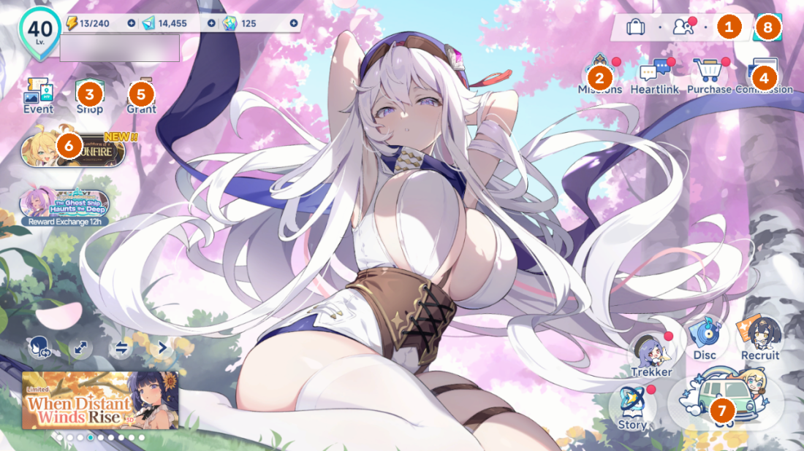
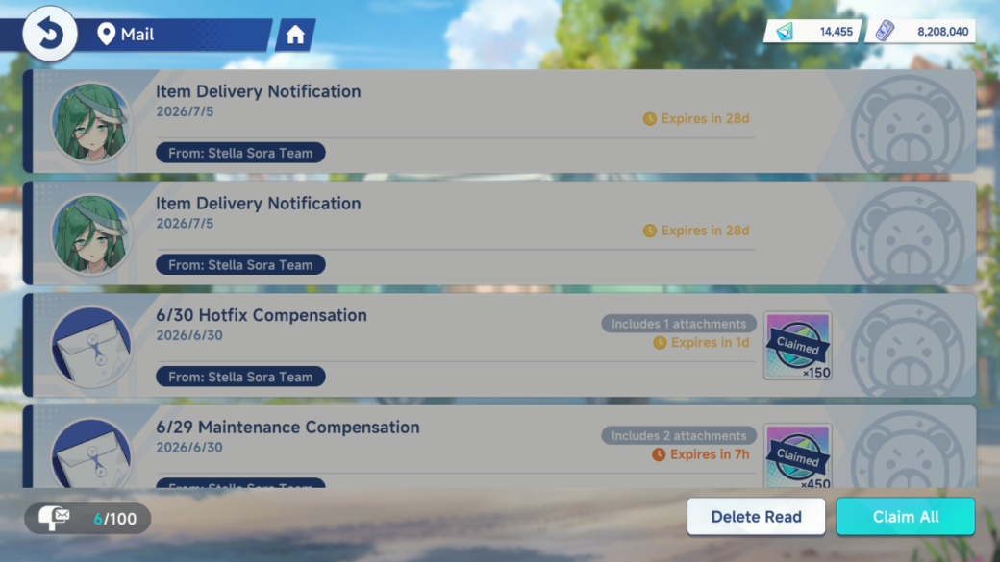
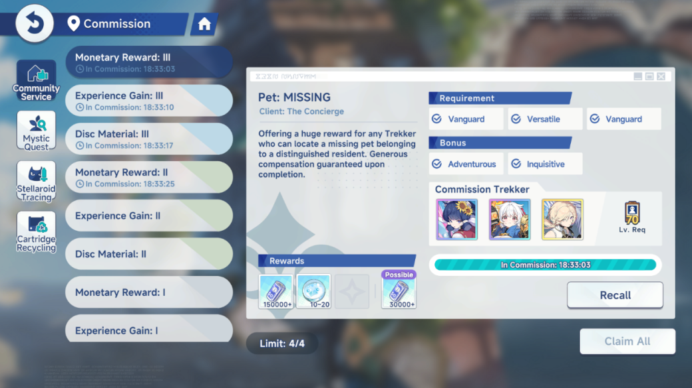
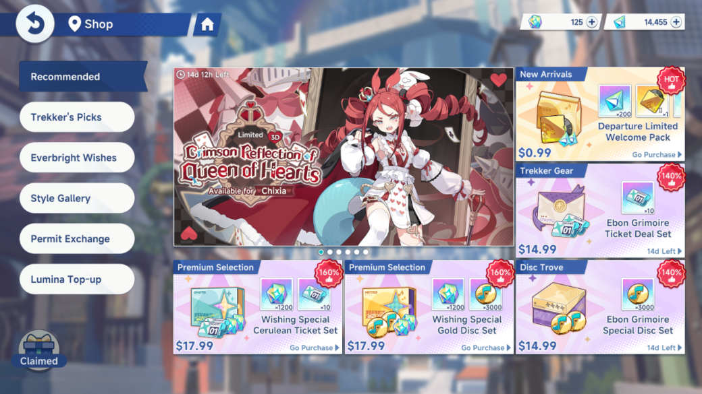
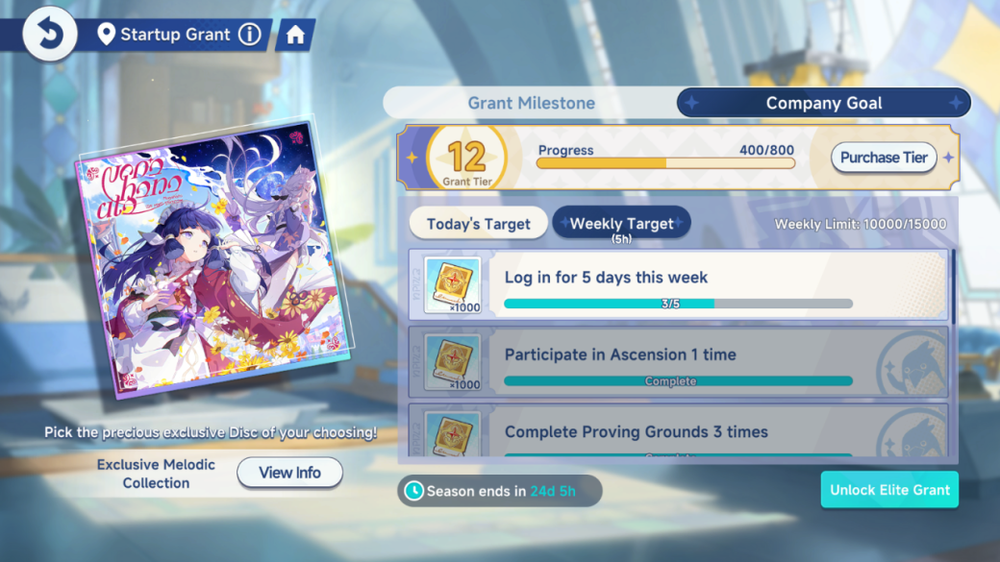
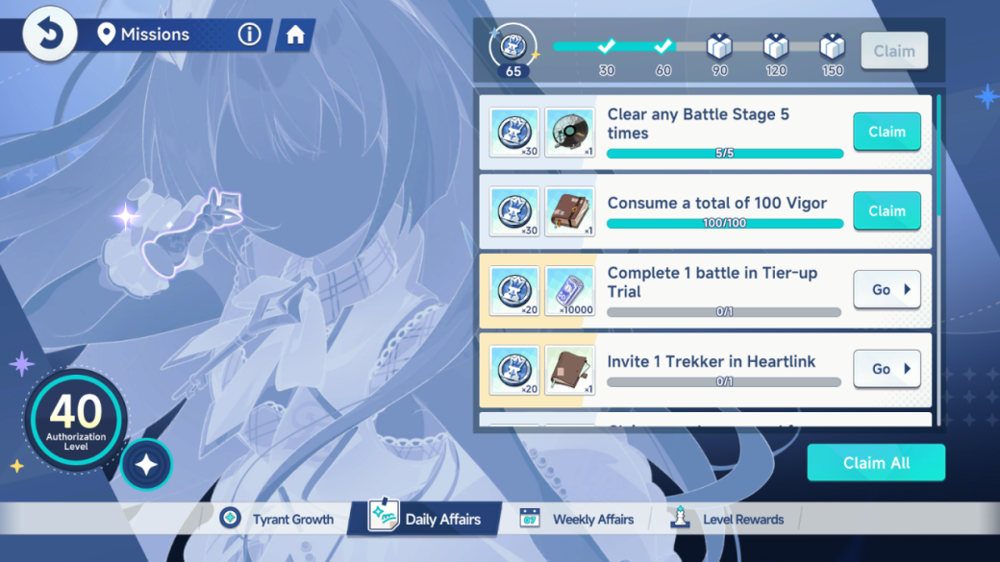
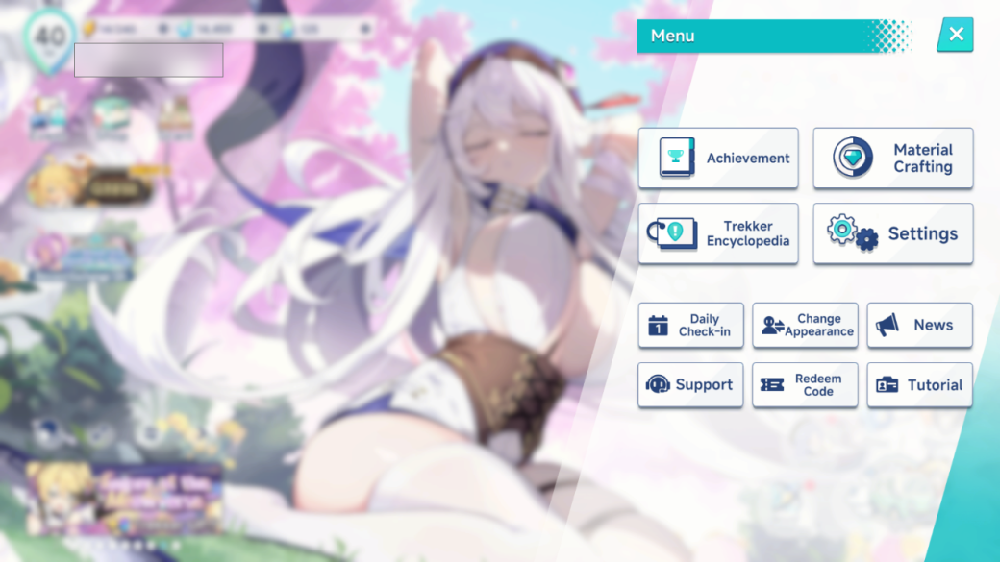

# Hướng dẫn sử dụng Stella Sora Tool (SST)

> Tài liệu hướng dẫn đầy đủ: từ cài đặt → cấu hình → từng chức năng.
> Dành cho **Stella Sora bản EN** chạy trên **giả lập Android** (khuyến nghị MuMu Player).
> Ảnh minh hoạ chụp từ game thật; **tên tài khoản đã được che** (ô mờ góc trái trên).

> ⚠️ Tự động hoá có thể vi phạm Điều khoản dịch vụ của game → **dùng tài khoản phụ khi thử nghiệm**,
> tự chịu rủi ro. Xem [README](../README.md) phần "Tuyên bố & Điều khoản".

---

## Mục lục
- [A. Cài đặt & chuẩn bị](#a-cài-đặt--chuẩn-bị)
- [B. Giao diện tool](#b-giao-diện-tool)
- [C. Màn hình chính của game (hub)](#c-màn-hình-chính-của-game-hub)
- [D. Chi tiết từng chức năng (task)](#d-chi-tiết-từng-chức-năng-task)
- [E. Lịch chạy tự động (scheduler)](#e-lịch-chạy-tự-động-scheduler)
- [F. Xử lý sự cố thường gặp](#f-xử-lý-sự-cố-thường-gặp)

---

## A. Cài đặt & chuẩn bị

### 1. Yêu cầu

| Thành phần | Yêu cầu |
|---|---|
| Giả lập | MuMu Player (khuyến nghị), hoặc LDPlayer/BlueStacks — có **ADB** |
| Độ phân giải | **PHẢI đúng `1280 × 720`** (rộng × cao, game chạy ngang). Panel "Android Device" của MuMu hiển thị đúng con số này |
| Game | **Stella Sora (bản EN)**, đã đăng nhập về màn Home |
| Máy tính | Windows 10/11 |

> ⚠️ **Độ phân giải phải chính xác 1280×720.** Tool nhận diện bằng ảnh mẫu ở đúng kích thước này và
> **không tự co giãn**. Đặt sai (1080×1920, 1600×900…) sẽ khiến tool báo lỗi và dừng.
> (Kéo to/thu nhỏ **cửa sổ** MuMu trên desktop thì vô hại — cứ zoom thoải mái để nhìn.)

### 2. Cách chạy — 2 lựa chọn

**Cách 1: Dùng bản đóng gói (không cần cài Python)**
1. Tải `StellaSoraTool-vX.Y.Z-win64.zip` mới nhất ở trang Releases.
2. Giải nén cả thư mục — giữ nguyên `app.exe`, `_internal/`, `assets/` cạnh nhau.
3. Chạy **`app.exe`**.

**Cách 2: Chạy từ mã nguồn (cho lập trình viên)**
```powershell
python -m venv venv
venv\Scripts\pip install -r requirements.txt
python app.py        # app desktop (khuyến nghị)
```

### 3. Cấu hình lần đầu (BẮT BUỘC)

Mở tool → vào trang **Cấu hình**, nhập:

| Ô | Ý nghĩa | Ví dụ |
|---|---|---|
| **Serial giả lập** | Địa chỉ ADB của giả lập | `127.0.0.1:16384` (MuMu) |
| **Đường dẫn adb.exe** | File adb kèm theo giả lập | `E:\MuMuPlayerGlobal\nx_device\12.0\shell\adb.exe` |
| **Giờ reset daily (UTC)** | Giờ game reset (mặc định `11:00` UTC ≈ 04:00 giờ VN−7 theo Yostar EN) | `11:00` |
| **Đóng game khi Cleanup** | Có tắt hẳn game sau khi xong không | tắt (để game ở Home) |

> Cách tìm **Serial**: mở giả lập → cửa sổ lệnh chạy `adb devices` sẽ liệt kê (vd `127.0.0.1:16384`).
> MuMu Player Global thường dùng cổng **16384**.

Sau khi lưu, file `config/stella.json` được tạo cạnh `app.exe`.

---

## B. Giao diện tool

Tool có **3 cách chạy**:

| Lệnh / cách | Chế độ |
|---|---|
| `app.exe` / `python app.py` | **App desktop** (cửa sổ WebView2) — khuyến nghị |
| `python gui.py` | Web UI tại `http://localhost:22270` |
| `python sst.py` | CLI — vòng lặp scheduler 24/7 |
| `python sst.py <Task>` | CLI — chạy 1 task rồi thoát |

**Bố cục app desktop:**
- **Rail trái**: Home · sst (bảng điều khiển) · Cấu hình.
- **Home**: đổi **ngôn ngữ VI/EN** và **giao diện Sáng/Tối**.
- **Bảng điều khiển (sst)**:
  - Nút **Start** (bắt đầu scheduler tự động) / **Stop** (ngắt task hiện tại ngay rồi dừng).
  - Danh sách task: **bật/tắt** từng task, nút **Chạy ngay** (đặt task đến hạn tức thì).
  - Các thẻ trạng thái: Scheduler / Đang chạy / Sẵn sàng / Chờ đến hạn.
  - Panel **Log** (Auto Scroll) — theo dõi trực tiếp.
- Một số task có **trang cài đặt riêng** (Ascension, Bounty Trial, Event) — xem [phần D](#d-chi-tiết-từng-chức-năng-task).

---

## C. Màn hình chính của game (hub)

Mọi task đều xuất phát từ màn **Home**. Các nút chức năng chính (đánh số):



| # | Nút | Task liên quan |
|---|---|---|
| 1 | **Mail** (thư, góc phải trên) | `Mail` |
| 2 | **Missions** | `DailyReward` |
| 3 | **Shop** (icon trái) | `Shop` |
| 4 | **Commission** | `Dispatch` |
| 5 | **Grant** | `Grant` |
| 6 | **Banner sự kiện** | `EventDaily` |
| 7 | **Go** (xe, góc phải dưới) | `BountyTrial`, `Ascension` (vào qua đây) |
| 8 | **Menu** (☰, góc phải trên cùng) | Daily Check-in, Settings game |

> Ghi chú điều hướng (quan trọng): **phím Back của Android không có tác dụng** trong game — mọi
> thao tác quay lại đều bằng nút trong game (nút 🏠 ở các trang con, hoặc nút thoát riêng).

---

## D. Chi tiết từng chức năng (task)

Thứ tự chạy mặc định: `Login → Mail → Dispatch → Shop → BountyTrial → Ascension → EventDaily → Grant → DailyReward → Cleanup`.

Task **bật sẵn**: Login, Mail, Dispatch, Shop, Grant, DailyReward, Cleanup.
Task **tắt sẵn** (tự bật khi cần): **BountyTrial, Ascension, EventDaily** — vì tiêu tài nguyên/vé hoặc cần cấu hình theo đợt.

---

### 1. `Login` — Đăng nhập & về màn hình chính
Mở game (nếu chưa chạy), vượt qua các popup đầu game, đưa về màn Home. Tự xử lý dialog
**"Network Error"** (bấm Retry/Start) khi rớt mạng. Đây là bước nền cho mọi task sau.

### 2. `Mail` — Nhận thư
Vào **Mail** (nút 1) → bấm **Claim All** nhận toàn bộ quà đính kèm. Thư đã nhận hiện nhãn **"Claimed"**.



### 3. `Dispatch` — Phái đội (Commission)
Vào **Commission** (nút 4). Gồm 2 việc:
- **Nhận đội đã về**: bấm Claim All, đóng popup "Commission Complete!" bằng nút **Back**.
- **Tái phái (Dispatch Again)**: điền các slot trống tới **4/4** — mỗi commission → **Quick Select**
  (tự chọn đội hợp yêu cầu) → chọn **20h** (thưởng cao nhất) → **Accept**. Hết Trekker thì dừng.



> Đội đi ~20h nên nhiều lượt chạy sẽ là "no-op" (chưa có đội về) — vô hại. Khi thiếu Trekker,
> tool tự bỏ qua và hẹn lại.

### 4. `Shop` — Nhận quà shop miễn phí
Vào **Shop** (nút 3) → nhận các quà **free/daily**. Đã nhận thì hiện nhãn "Claimed" (tool bỏ qua).



### 5. `BountyTrial` — Tiêu Vigor (Quick Battle sweep) · *mặc định TẮT*
Vào **Go** (nút 7) → **Bounty** → chọn Trial → **Quick Battle** để auto-clear (sweep) tối đa theo Vigor.

**Cài đặt riêng** (trang Bounty Trial):
| Tuỳ chọn | Ý nghĩa |
|---|---|
| **Loại Trial** | `Basic` (nguyên liệu) · `Tier-up` (thăng bậc) · `Skill` (nâng skill) · `Emblem` |
| **Độ khó** | `0` = giữ nguyên game nhớ; `1–6` = ép đúng bậc (bậc phải đã clear mới sweep được) |

> ⚠️ Task này **tiêu Vigor** — bật khi bạn muốn dồn Vigor vào Trial.

### 6. `Ascension` — Chạy Monolith (Quick Battle) · *mặc định TẮT*
Vào **Go** (nút 7) → **Ascension**. Mỗi run tốn **1 vé Monolith** (không tốn Vigor). Tool tự chọn thẻ,
mua đồ trong shop giữa run, enhance, và lưu Record. Đây là task **nhiều tuỳ chọn nhất**.

**Cài đặt riêng** (trang Ascension) — các nhóm chính:
| Nhóm | Tuỳ chọn tiêu biểu |
|---|---|
| Vé & số run | **Số run mỗi lần** (hết vé tự dừng) |
| Map | Giữ map game nhớ / chọn Currents·Dust·Storm (tránh Misstep để farm) |
| Difficulty | `0` = tự chọn bậc đã-clear cao nhất (khuyến nghị) / ép bậc 2–8 |
| Squad | `0` = giữ nguyên / chọn squad số N |
| Preset | Khi "Preset not set": Cảnh báo / Bỏ qua / **Báo lỗi & dừng** (mặc định) |
| Chọn thẻ | Mức tăng level cao nhất (mặc định) / Ưu tiên Super Rare / Trái nhất |
| Shop | Chỉ mua Melody khi cần · mốc/dự trữ coin enhance · refresh kệ phòng cuối |
| Run | Brief mode · Lưu Record · **Bỏ qua khi Weekly Limit đầy** · thời gian tối đa |

> Mặc định đã tối ưu theo meta (POWER — Record mạnh). Chỉ chỉnh khi bạn hiểu rõ từng mục.
> Chi tiết chiến lược: `docs/ascension-strategy.md`.

### 7. `EventDaily` — Sweep sự kiện · *mặc định TẮT*
Vào **banner sự kiện** ở Home (nút 6) → Battle Stage → **Quick Battle** sweep; sau đó nhận quà
Event Missions nếu có chấm đỏ.

**Cài đặt riêng** (trang Event):
| Tuỳ chọn | Ý nghĩa |
|---|---|
| **Stage** | để trống = stage cao nhất; hoặc nhập `W-N` (vd `1-12`) để chọn đúng stage |
| **Số trận** | `0` = tối đa theo Vigor; `N` = đúng N trận |

> ⚠️ Sự kiện theo đợt: **mỗi đợt phải re-crop banner** (`assets/en/event/EVENT_BANNER.png`) và chỉnh
> lại stage trước khi bật. Không tìm thấy banner → tool bỏ qua an toàn (không chạy nhầm).

### 8. `Grant` — Nhận Startup Grant · *mặc định BẬT*
Vào **Grant** (nút 5) → màn **Startup Grant**. Có 2 tab (**Grant Milestone** và **Company Goal**),
mỗi tab có chấm đỏ riêng khi có quà. Tool nhận **Company Goal trước** (cộng progress → lên Grant Tier
mở quà Milestone) rồi **Claim All** cả hai. Quà free, không rủi ro.



### 9. `DailyReward` — Nhận nhiệm vụ hằng ngày
Vào **Missions** (nút 2) → tab Daily → **Claim All** các nhiệm vụ + mốc điểm (VD 100 Stellanite Dust).



### 10. `Cleanup` — Dọn & kết thúc
Đưa game về màn Home. Nếu bật **"Đóng game khi Cleanup"** trong Cấu hình thì tắt hẳn game.

### (Thêm) Daily Check-in — điểm danh
Nằm trong **Menu** (nút 8) → **Daily Check-in**. Menu cũng chứa **Settings** (đổi độ phân giải game),
Redeem Code, v.v.



---

## E. Lịch chạy tự động (scheduler)

- Mỗi task có công tắc **bật/tắt** và mốc **"chạy kế tiếp"** (`next_run`).
- Bấm **Start** → scheduler chạy task nào đến hạn, xong **tự hẹn lần sau**:
  - Task daily → hẹn tới **giờ reset** kế tiếp.
  - Task thiếu tài nguyên (Dispatch chưa có đội về, Vigor chưa đủ…) → hẹn lại sau **vài phút/giờ**.
- Có thể **treo máy 24/7**: tool tự lặp, chạy đúng giờ, tự phục hồi khi lỗi (chụp log + screenshot).
- Muốn chạy tay 1 task: bấm **Chạy ngay** (GUI) hoặc `python sst.py <Task>` (CLI).

> Bấm **Stop** sẽ **ngắt task hiện tại ngay** (tại thao tác chụp/bấm kế tiếp, trễ tối đa vài giây)
> rồi dừng scheduler. Task bị ngắt **không bị phạt lịch** — lần Start sau sẽ chạy lại từ đầu, game
> không bị hỏng gì (tool chỉ dừng bấm, mọi thứ dở dang trong game vẫn nguyên). Khi đóng app/exe giữa
> chừng = kill tiến trình → nên bấm Dừng trước cho gọn.

---

## F. Xử lý sự cố thường gặp

| Triệu chứng | Nguyên nhân & cách xử lý |
|---|---|
| Báo lỗi độ phân giải / dừng ngay | Giả lập không ở **1280×720** → chỉnh lại trong cài đặt giả lập |
| "Không connect được `<serial>`" | Sai **Serial** hoặc **đường dẫn adb.exe**; giả lập chưa mở → kiểm lại Cấu hình |
| Nhận diện sai nút / kẹt màn lạ | Game **update UI** làm vỡ ảnh mẫu → cần cập nhật asset (crop lại nút bị lệch) |
| Task chạy nhưng "no-op" liên tục | Bình thường với Dispatch/Bounty khi chưa đủ tài nguyên — tool tự hẹn lại |
| Event không chạy | Chưa **re-crop banner** đợt mới / chưa set stage → xem task EventDaily |
| Máy khác chạy exe | Phải sửa lại **Serial + đường dẫn adb** cho giả lập của máy đó |

> Log & ảnh lỗi tự lưu trong thư mục `log/` cạnh `app.exe` — gửi kèm khi cần hỗ trợ.

---

📚 Tài liệu liên quan: [README](../README.md) · [CHANGELOG_VN](../CHANGELOG_VN.md) ·
`docs/game-map.md` (bản đồ điều hướng) · `docs/ascension-strategy.md` (chiến lược Ascension).
